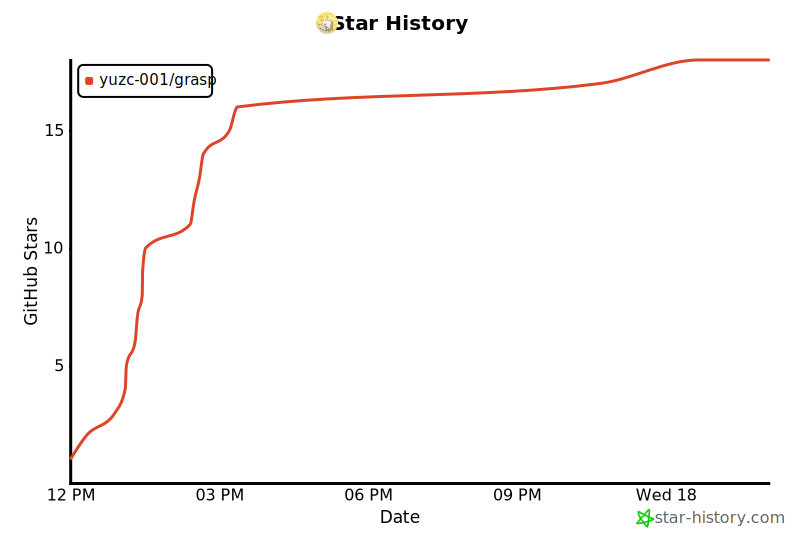

# Grasp

[English](./README.md) · [简体中文](./README.zh-CN.md) · [GitHub](https://github.com/Yuzc-001/grasp) · [Issues](https://github.com/Yuzc-001/grasp/issues)

[](./CHANGELOG.md)
[](./LICENSE)
[](./README.md#install)
[](https://www.npmjs.com/package/grasp)

> **Give AI its own browser runtime.**
>
> Persistent state, verified actions, and recoverable handoff — on your machine, in your Chrome profile.

Grasp is an open-source MCP browser runtime for AI agents. It runs entirely on your machine, connects to a dedicated `chrome-grasp` profile, and gives agents not just browser control, but browser continuity: page grasp, action verification, handoff persistence, and recovery after human intervention.

**Current release:** `v0.4.0`

**Release docs:**
- [Release Notes](./docs/release-notes-v0.4.0.md)
- [Implementation Milestone](./docs/grasp_v0.4_主干里程碑_v1.md)
- [Product Positioning](./docs/grasp_作品诊断与定位收紧建议_v1.md)

---

## What makes v0.4 different

`v0.4` is not just “more browser tools”.
It is the point where Grasp starts acting like a browser runtime instead of a browser wrapper.

### v0.4 mainline
- **Runtime Truth** — browser/runtime status is normalized into a single truth layer
- **Page Grasp** — Grasp tracks page role, confidence, page identity, and reacquisition state
- **Verified actions** — `click` / `type` return structured evidence instead of blind success
- **Recoverable handoff** — human-required steps can be requested, persisted, and resumed across calls
- **Task continuation anchors** — resume can verify expected URL, page role, and selector presence
- **False-verified defense** — Grasp can reject a resumed session when the page came back but the task did not

### What Grasp claims in v0.4
- the agent can own a persistent browser profile
- the agent can reason over a compact semantic view of the page
- the agent can verify observable action outcomes
- the agent can survive handoff / resume across calls
- the agent can reject wrong recovery when continuation anchors do not match

### What Grasp does not claim in v0.4
- universal bypass of high-friction or strongly verified environments
- fully autonomous completion of every login or CAPTCHA flow
- full task-semantic recovery for every multi-step workflow

In short:

# Grasp v0.4 is about continuity, not just control.

---

## Design

The agent should have its own browser. Not a borrowed session, not a fresh blank tab — a persistent profile it owns, with credentials that accumulate over time.

`chrome-grasp` is that profile. The agent logs in to the services it needs. Those sessions outlast every run. Your tabs and history are never touched.

Four principles shape how Grasp works:

**Local and open.** The entire codebase is MIT-licensed and runs on your hardware. No cloud backend. No telemetry. No account. What the agent does is visible only to you.

**Semantic perception, not raw HTML.** Grasp scans the live viewport and produces a compact Hint Map — a stable, minimal representation of what is interactable on screen:

```
[B1] Submit order      (button, pos:450,320)
[I1] Coupon code       (input,  pos:450,280)
[L2] Back to cart      (link,   pos:200,400)
```

IDs are fingerprint-stable across calls. Token cost drops 90%+ versus passing raw HTML. The agent reasons about UI through structured, meaningful data.

**Real input plus verification.** Every click traces a curved path across the screen. Every scroll arrives as a sequence of wheel events. Every keystroke carries its own timing. This is input dispatched through Chrome DevTools Protocol — not `element.click()`. In `v0.4`, that input is increasingly paired with post-action verification and grasp evidence.

**Handoff is first-class.** For high-friction or strongly verified environments, Grasp accepts one-time human presence. It does not try to erase every gate. It turns a necessary human step into persisted browser state and a recoverable continuation path.

**It does not eliminate gates. It eliminates the repetition of gates — and it rejects the wrong recovery.**

---

## Install

### One command

```bash
npx grasp
```

Detects Chrome, launches it with the `chrome-grasp` profile, and auto-configures your AI client. First run opens the browser — log in to any services your agent will use. Sessions are saved permanently.

### Claude Code

```bash
claude mcp add grasp -- npx -y grasp
```

### Claude Desktop / Cursor

```json
{
  "mcpServers": {
    "grasp": {
      "command": "npx",
      "args": ["-y", "grasp"]
    }
  }
}
```

### Codex CLI

```toml
[mcp_servers.grasp]
type    = "stdio"
command = "npx"
args    = ["-y", "grasp"]
```

---

## CLI

| Command | Description |
|:---|:---|
| `grasp` / `grasp connect` | Setup wizard — detect Chrome, launch, configure AI clients |
| `grasp status` | Connection state, current tab, recent activity |
| `grasp logs` | View audit log (`~/.grasp/audit.log`) |
| `grasp logs --lines 20` | Last 20 entries |
| `grasp logs --follow` | Stream in real time |

---

## MCP tools

### v0.4 mainline surface

| Tool | Description |
|:---|:---|
| `navigate` | Navigate to a URL and refresh runtime/page grasp state |
| `get_status` | Current browser/runtime status, page role, grasp confidence, handoff state |
| `get_page_summary` | Title, URL, mode, and concise visible content |
| `get_hint_map` | Return the semantic interaction map for the current viewport |
| `click` | Click by hint ID with post-action verification and evidence |
| `type` | Type by hint ID with verification |
| `hover` | Hover by hint ID and refresh visible interaction state |
| `press_key` | Send keyboard input and refresh page state |
| `watch_element` | Watch a selector for appears / disappears / changes |
| `scroll` | Scroll the current page and refresh page grasp |
| `request_handoff` | Persist that the workflow now requires human help |
| `mark_handoff_in_progress` | Mark that a human is actively handling the step |
| `mark_handoff_done` | Mark that the human step is complete and reacquisition should begin |
| `resume_after_handoff` | Reacquire the page and verify continuation anchors before resuming |
| `clear_handoff` | Clear handoff state and return to idle |

### Notes on the v0.4 surface

- `resume_after_handoff` supports task continuation anchors:
  - `expected_url_contains`
  - `expected_page_role`
  - `expected_selector`
- Anchors can be persisted in `request_handoff` and inherited automatically during resume
- Continuation mismatch now causes `resumed_unverified` instead of a false `verified` state

Legacy and auxiliary capabilities may still exist in the codebase, but the table above is the current `v0.4` mainline surface.

---

## Configuration

| Variable | Default | Description |
|:---|:---|:---|
| `CHROME_CDP_URL` | `http://localhost:9222` | Chrome remote debugging address |
| `GRASP_SAFE_MODE` | `true` | Intercept high-risk actions before execution |

Persistent config at `~/.grasp/config.json`.

## Recovery Semantics

`v0.4` tools increasingly surface structured recovery signals through response metadata:

- `error_code` identifies the failure class (`CDP_UNREACHABLE`, `STALE_HINT`, `ACTION_NOT_VERIFIED`, and friends)
- `retryable` tells the caller whether bounded recovery is safe
- `suggested_next_step` points to the next move (`retry`, `reobserve`, `wait_then_reverify`)
- `evidence` includes the page-level details used by the verifier
- handoff recovery can also include continuation evidence showing whether expected URL / role / selector anchors matched

This is part of the larger `v0.4` shift:
- not just executing browser actions
- but deciding whether recovery was actually valid

Benchmark smoke scenarios and reporting rules still live in [docs/benchmarks/search-benchmark.md](./docs/benchmarks/search-benchmark.md).

---

## Repository

```
index.js                    CLI entry, MCP server bootstrap
src/
  server/                   Tool registry, state, audit, responses
  layer1-bridge/            Chrome CDP connection, WebMCP detection
  layer2-perception/        Hint Map, fingerprint registry
  layer3-action/            Mouse curves, wheel scroll, keyboard events
  cli/                      connect · status · logs · auto-configure
examples/                   Client config samples
start-chrome.bat            Windows Chrome launcher
```

---

## License

MIT — see [LICENSE](./LICENSE).

## Contact

- Issues: https://github.com/Yuzc-001/grasp/issues

## Claude Code Skill

Install the bundled skill to give Claude structured knowledge of every Grasp tool — workflows, hint map usage, safety mode, and WebMCP detection.

**OpenClaw:** Search for `grasp` and install in one click.

**Manual install:**

```bash
curl -L https://github.com/Yuzc-001/grasp/raw/main/grasp.skill -o ~/.claude/skills/grasp.skill
```

Once installed, Claude automatically knows when and how to use Grasp — no manual prompting needed.

---

## Star history

[](https://star-history.com/#Yuzc-001/grasp&Date)

---

[README.zh-CN.md](README.zh-CN.md) · [CHANGELOG.md](CHANGELOG.md) · [CONTRIBUTING.md](CONTRIBUTING.md)
